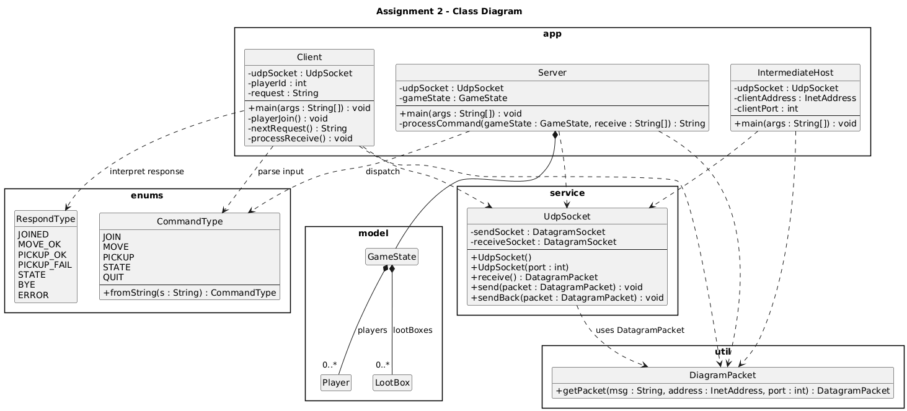
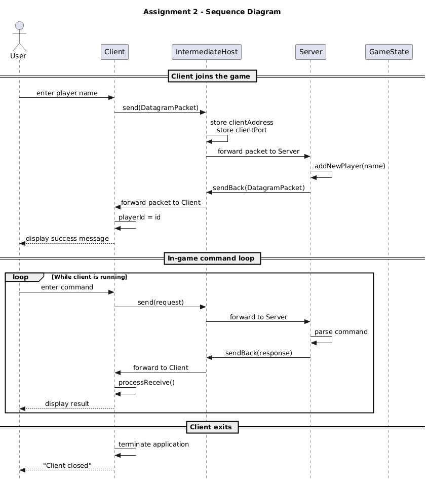
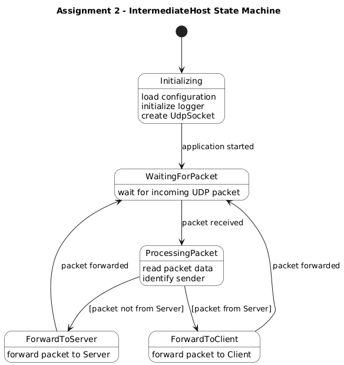
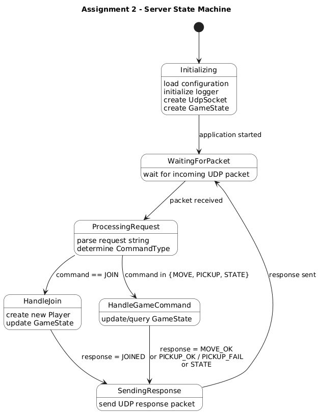

# Assignment 2 - Introduction to UDP

## 📌 Project Information
- **Course**: SYSC3303A
- **Assignment**: Assignment 2 - Introduction to UDP
- **Author**: Eric(Yikuan) Mao
- **Student ID**: 101220327
- **Date**: 26 / 02

---

## 📖 Description
- [SYSC3303A W26 A2.pdf](resources/SYSC3303A%20W26%20A2.pdf)
- 
- 
- 
- 
- 
---

## 🛠️ Environment
- **Programming Language**: Java
- **Java Version**: Java 24
- **IDE**: IntelliJ IDEA

---

## 📂 Project Structure
```
Assignment2/
├── src/
│ ├── common/
│ │ ├── enums/
│ │ │ ├── CommandType.java
│ │ │ └── RespondType.java
│ ├── model/
│ │ └── ...(example codes from BS)
│ ├── service/
│ │ └── UdpSocket.java
│ ├── util/
│ │ └── DiagramPacket.java
│ ├── test/
│ │ └── *Some unit tests is in here
│ ├── Client.java               <-- Run Client
│ ├── IntermediateHost.java     <-- Run IntermediateHost
│ └── Server.java               <-- Run Server
├── resources/
├── README.md
└── config.properties           <- config file
```

#### Run Components
* [Client.java](src/Client.java)
* [IntermediateHost.java](src/IntermediateHost.java)
* [Server.java](src/Server.java)
- !!! Please run all 3 components before sending first message as client to avoid locks and errors, order doesn't matter.